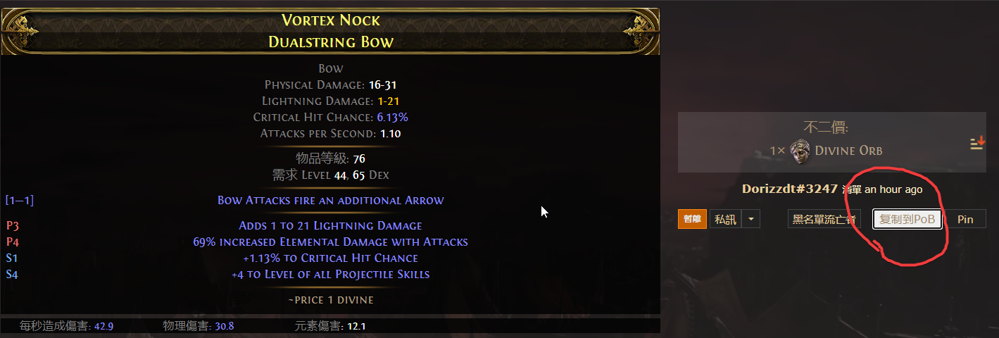

# poe2tradecopytopob

A Browser extensions to help copy POE2 web trade item infomation to pob

Cooperate with pob to help you find the right equipment for you faster

# How to use

1.download zip file from [Here](https://github.com/haoyuwhy/poe2tradecopytopob/releases/tag/public)

2.drop the zip file to you browser extensions manager

3.open poe2 trade web and copy, then paste to pob
